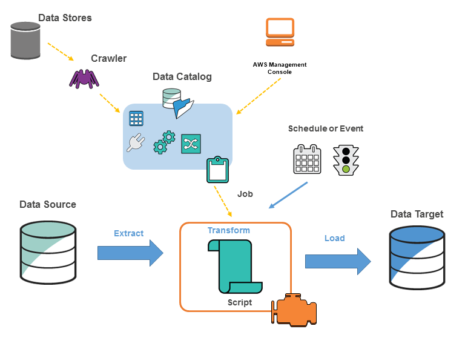

## Covid-19 Data Analysis on AWS Stack
Provide COVID-19 insights through visualization for general public awareness, researchers and health officials from data, which is updated everyday
***
### Architecture:
*todo*
***
### Goal
Build an automated data pipeline hosted by AWS, to perform ETL operations on the COVID data which is extracted from Github and perform queries and visualization to extract meaningful insights.

### Tech Stack(AWS):
1. **S3**: Datalake and object storage
2. **Lambdas**: Seamless data preprocessing
3. **Glue**: Data transformation and ingestion
4. **Redshift**: Datawarehouse and Analytics
5. **Quicksight**: Visualization
6. **EventBridge**: Scheduling and Orchestration
7. **Cloudwatch**: To monitor the resources

### Prerequisites:
1. Python knowledge (boto3 library)
2. AWS Cli setup
3. Basic knowledge on IAM roles and policies

### Implementation:
AWS services can be created from the AWS Console easily, and it is self-explanatory. I've provided the commands if you want to create the services from the terminal. 
#### 1. Create the S3 directories: 
Copy the data from [Github](https://github.com/CSSEGISandData/COVID-19), where the data is updated on daily basis. Create S3 buckets to organize the archived data, corfirmed cases, deaths and recovered cases.
Run the script to create the bucket:
```
import boto3
s3 = boto3.client('s3')
bucket_name = 'covidanalysis'
s3.create_bucket(Bucket=bucket_name)
print(f"Bucket '{bucket_name}' created successfully.")
```
The folders or prefixes are created directly, when put_object() method is initialized in the lambdas.

#### 2. Create a EventBridge schedule:
Create a schedule to run the lambda(copy_github_to_s3) every day at 12AM CST(my time zone). So, the lambda automatically loads the data from github and stores it in the datalake(S3). 
```
aws events put-rule --name DailyLambdaExecutionRule --schedule-expression "cron(0 6 * * ? *)" --state "ENABLED"
```

#### 3. Create a extract Lambda:
Create a lambda to extract the data from the Github repository to local datalake(S3).
```
aws lambda create-function \
  --function-name copy_github_to_s3 \
  --runtime python3.8 \
  --handler lambda_function.lambda_handler \
  --role arn:aws:iam::YOUR_ACCOUNT_ID:role/your-execution-role 
```
Run the script [copy_github_to_s3.py](scripts/copy_github_to_s3.py) on the created lambda instance and add the Lambda's ARN as the target destination to the above EventBridge schedule. 
```
aws events put-targets --rule DailyLambdaExecutionRule --targets "Id"="1","Arn"="arn:aws:lambda:us-east-1:<YOUR_ACCOUNT_ID>:function:copy_github_to_s3"
```

#### 4. Create a lambda to launch Glue:
Create a python lambda function `launch_glue_job` and run the script `launch_glue_job.py`, which initiates a glue job using boto3.

#### 5. EventBridge Rule to connect the above lambdas:
Once the data is loaded into the datalake, `launch_glue_job` lambda should be trigged. Hence, a EventBridge pattern matching rule is used to trigger the glue lambda once the extract lambda is executed. Here's how to create a eventbridge rule:
```
aws events put-rule --name S3toGlue --event-pattern '{
  "source": ["arn:aws:lambda:us-east-1:<YOUR_ACCOUNT_ID>:function:copy_github_s3"],
  "detail-type": ["Lambda Function Execution Status Change"],
  "detail": {
    "status": ["success"]
  }
}' --state "ENABLED"
```
Now mention the target to be triggered the the above eventbridge:
```
aws events put-targets --rule S3toGlue --targets "Id"="1","Arn"="arn:aws:lambda:us-east-1:YOUR_ACCOUNT_ID:function:launch_glue_job"
```
Make sure that the rule pattern matches of the EventBridge matches with the event entry in the source lambda (`copy_github_to_s3`)

#### 6. Create a Glue job status lambda:
Create a lambda function to track the glue job status every 5 seconds using the script: [glue_job_status.py](scripts/glue_job_status.py). This is a regulation step to monitor the Glue job status via logs on AWS CloudWatch. CloudWatch tracks the logs categorized by the jobID of the AWS services.

#### 7. EventBridge rule for Glue job status lambda:
The `glue_job_status` lambda is triggered by an eventbridge rule which pattern matches with the source lambda(`launch_glue_job`). The eventbridge rule can be created similar to `S3toGlue` mentiond in 
[STEP 5]( 5. EventBridge Rule to connect the above lambdas:)

#### 8. Run the Glue Job:
*Todo*
***
#### Insights:
These are a few resources I've found useful while developing this project.

**Lamdba Limitations**:
Memory: 128MB-10GB
Execution Time: 900sec(15mins)
Env variables: 4KB
Deployment size(compressed zip): 50MB
Deployment size(unccompressed code+dependencies): 250MB

**Redshift**: 
* Redshift cluster nodes can have multiple availability zones and snapshots can be created for quick backups.
* Uses Column-based storage, which works best for analytics (OLAP). 

**Glue Architecture**: 
